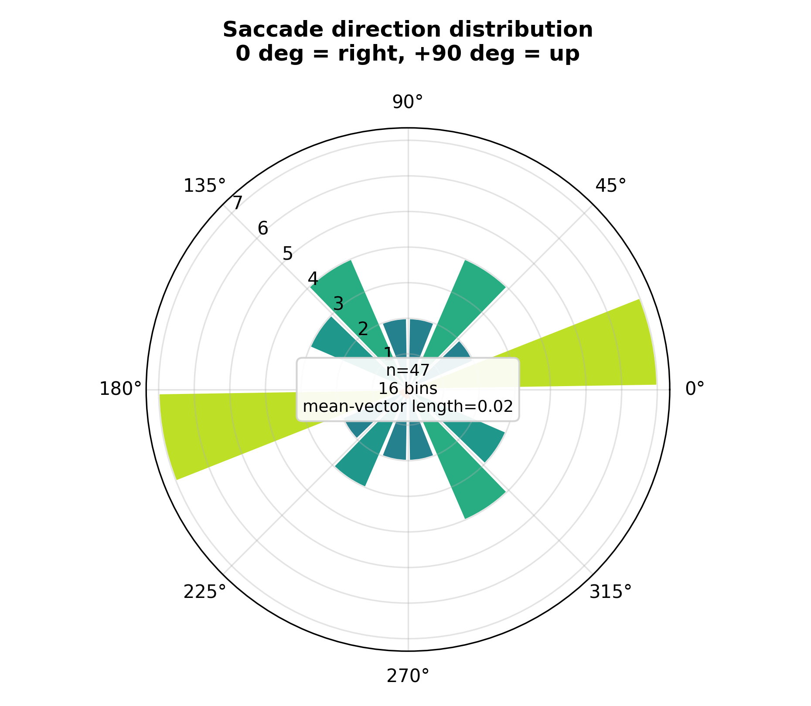

# Results: pupillometry {#sec:pupilresults}

A sinusoidal pupil signal with an injected NaN blink is correctly deblinked (no
residual NaNs), and the interpolated-plus-smoothed trace coincides with the
underlying sine away from the blink window — the blink is bridged, not
fabricated. A fully-invalid trace is reported as unusable rather than silently
flattened, so a recording the camera never resolved cannot masquerade as a flat
pupil. These are recovery checks against a known generator, not statements about
pupil-size accuracy on a real eye ([@sec:limitations]).

The causal phase detector labels peaks within a two-sample window of the analytic
sine maxima, and the online-equals-offline-prefix test confirms it consults no
future sample: replaying the signal one sample at a time reproduces the offline
labels exactly up to each prefix, so the causality property of [@sec:pupillometry]
holds empirically rather than by assertion. The detected peak and trough counts
match the number of sine cycles in the trace, the coarsest sanity bound on the
detector. Saccade direction distributions over the same synthetic sessions are
summarised as polar histograms ([@fig:polar]).

{#fig:polar width=75%}
